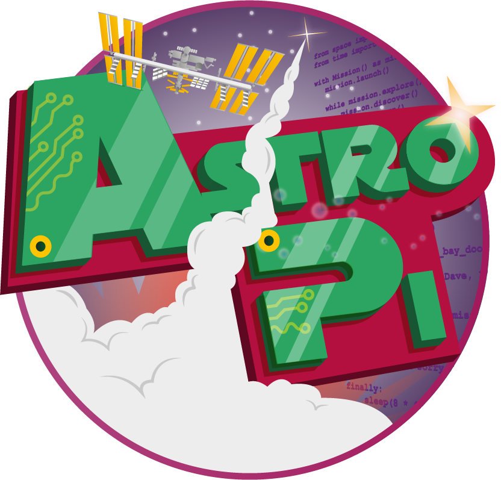

# Astro-Pi Hat

This guide is designed to get you up and running with the Astro-Pi HAT. It will introduce you to what the board does, how to set it up, and how to write your first program.

## Guides:

- [Astro Pi- What Is It?](board.md)
- [Assemble The Astro Pi](assemble.md)
- [Software Setup](software.md)
- [Astro Pi- First Program](program.md)

## Where Next?

Now that you have completed this guide you might want to go further:

- [Getting Started with Astro-Pi]()
- [Astro-Pi Lessons]()
