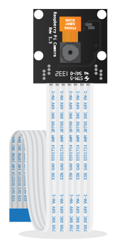

# The Raspberry Pi Camera Module

The Raspberry Pi camera can take full HD 1080p photo and videos. It can also be programmed using code. There are two versions of the camera, standard and Pi Noir. Both are connected to a Raspberry Pi in the same way.

## Camera Module 

Pictured above is the standard Raspberry Pi camera module.

## Pi Noir Camera Module

Pictured above is the special version of the Raspberry Pi camera board called Pi NoIR. It is identical to the normal green camera but it has no infrared filter, meaning that it lets in infrared light. This camera, combined with an infrared light source, will give you night vision. 

## Camera Guides
- [Quick Camera Setup Guide](quick-camera-setup.md)
- [Programming the Camera Module]()
