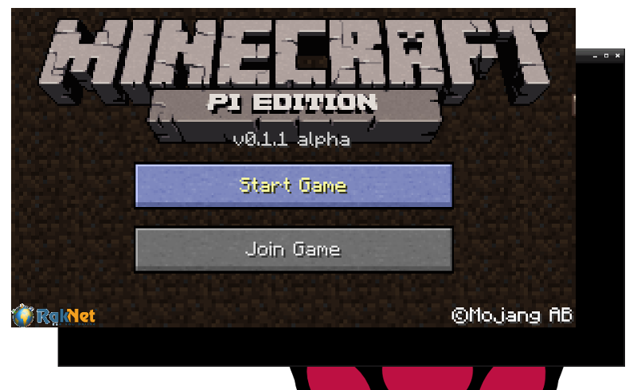

# Playing & controlling Minecraft Pi

If you've never played minecraft before here's the place to start. The guide below explains how to get started playing minecraft, or you could watch this video.

https://www.youtube.com/edit?o=U&video_id=E4OODVwvRWo

## Launching Minecraft

To run Minecraft, select the icon under the **games** menu or enter `minecraft-pi` in the terminal.

When Minecraft Pi has loaded, click on **Start Game**, followed by **Create new**. You'll notice that the containing window is offset slightly. This means to drag the window around you have to grab the title bar behind the Minecraft window.

## Moving around

You are now in a game of Minecraft! Go walk around, hack things, and build things!

You and use the mouse to control which direction the player is looking in and the keyboard to control movement.

| Key          | Action               |
| :---:        | :-----:              |
| W            | Walk Forward         |
| A            | Step Left            |
| S            | Walk Backward        |
| D            | Step Right           |
| Space        | Jump                 |
| Control      | Crouch               |

You can also switch to what's called "creative mode" which allows you to fly!

| Key          | Action               |
| :---:        | :-----:              |
| Double Space | Enter / Exit "Creative Mode"   |
| Space        | Fly Up               |
| Control      | Fly Down             |
| W,A,S,D      | Fly Forward,Left,Back,Right    |

## Placing / Smashing Blocks

The entire Minecraft World is made up of blocks, which can be placed or destroyed in order to create things.

| E            | Inventory            |

| Esc          | Pause / Game menu    |
| Tab          | Release mouse cursor |

You can select an item from the quick draw panel with the mouse's scroll wheel (or use the numbers on your keyboard), or press `E` and select something from the inventory.

You can also double tap the space bar to fly into the air. You'll stop flying when you release the space bar, and if you double tap it again you'll fall back to the ground.

With the sword in your hand, you can click on blocks in front of you to break them (or to dig). With a block in your hand, you can use right click to place that block in front of you, or left click to remove a block.

Spend some time getting familar with moving around the world if you've not played it before, you can explore, build something cool, whatever you want.
