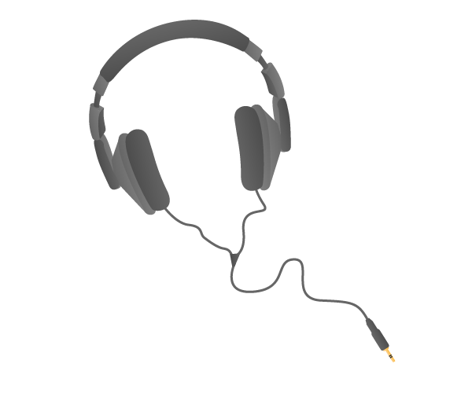

# Quick Raspberry Pi Setup Guide

Got a Raspberry Pi? Great, let's get started by making sure you have all the cables and accessories before plugging them all in and logging in for the first time.

## What you will need:

Before you plug anything into your Raspberry Pi, make sure that you have all the equipment listed here:

### Required:
- **SD Card** We recommend an 8GB class 4 SD card – ideally preinstalled with NOOBS. You can buy a card with NOOBS pre-installed, or you can download it for free from our downloads page.

  

- **Display** Any HDMI/DVI monitor or TV should work as a display for the Pi. 

  

- **Display Cables** For best results, use one with HDMI input, but other connections are available for older devices. 
  

- **Keyboard and mouse** Any standard USB keyboard and mouse will work with your Raspberry Pi.

  
  
  

- **Power supply** Use a 5V micro USB power supply to power your Raspberry Pi. Be careful that whatever power supply you use outputs at least 5V; insufficient power will cause your Pi to behave in strange ways.

  

### Not essential but helpful to have:

- **Internet connection** To update or download software, we recommend that you connect your Raspberry Pi to the internet either via and ethernet cable or a wifi adapter. Use a standard Ethernet cable for internet access.

  

- **Headphones or speakers**  Headphones, earphones or speakers with a 3.5mm jack will work with your Raspberry Pi.

  
  
  

## Plugging in your Raspberry Pi

1. Begin by slotting your SD card into the SD card slot on the Raspberry Pi, which will only fit one way.
1. Next, plug in your USB keyboard and Mouse into the USB slots on the Raspberry Pi.
1. Make sure that your monitor or TV is turned on, and that you have selected the right input (e.g. HDMI 1, DVI, etc)
1. Then connect your HDMI cable from your Raspberry Pi to your monitor or TV.
1. If you intend to connect your Raspberry Pi to the internet, plug in an ethernet cable into the ethernet port next to the USB ports, otherwise skip this step.
1. When you are happy that you have plugged in all the cables and SD card required, finally plug in the micro usb power supply. This action will turn on and boot your Raspberry Pi.
1. If this is the first time your Raspberry Pi and NOOBS SD card have been used, then you will have to select an operating system and configure it. Follow the NOOBS guide to do this.

## Logging into your Raspberry Pi 

1. Once your Raspberry Pi has completed the boot process, a login prompt will appear. The default login for Raspbian is username `pi` with the password `raspberry`. *Note you will not see any writing appear when you type the password. This is a security feature in Linux.*
1. After you have successfully logged in, you will see the command line prompt `pi@raspberrypi~$`
1. To load the graphical user interface, type `startx` and press `Enter` on your keyboard.

