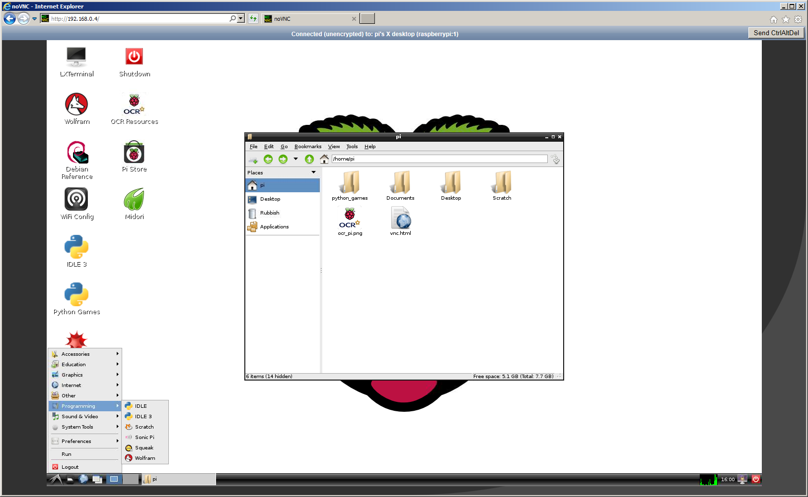
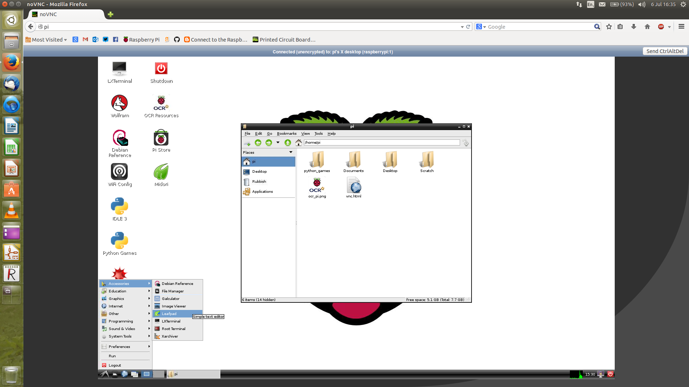

# Remote desktop to a Raspberry Pi through your web browser 

This guide is a slight variant on using remote desktop, such as VNC, to connect to a Raspberry Pi. 

The basic premise is to use another computer as the input console for the Raspberry Pi without needing to get a separate screen, keyboard, and mouse on the Pi. This is ideal if, for example, you've got a room full of laptops, Chromebooks or iMacs.

This differs from the previous method in that you don't need to install any software on the host computer/laptop. You can set the Raspberry Pi up so that it provides everything the host computer needs through the web browser. It makes it as easy as typing an address in.

Here is an example of the end product on Windows / IE:



## What will it work on?

This system will work on any HTML5-compliant web browser, in particular these browser versions or later:

- Chrome 8
- Firefox 4
- Safari 5
- iOS Safari 4.2
- Opera 11
- IE 9

## Step 1: Setting up the server on a Raspberry Pi

1. Start with a fresh install of Raspbian and log in as the default `pi` user. You can use the command line interface for this guide.
1. Install the following packages (TightVNC server and screen). Run these commands from the terminal:

	```
	sudo apt-get update
	sudo apt-get install tightvncserver screen -y
	```

1. Next run TightVNC server, which will prompt you to enter a password and an optional view-only password, by typing `tightvncserver` and pressing **Enter** on the keyboard.

1. Now let's get the HTML5 VNC client. Enter the following commands and press **Enter** at the end of each line:

	```
	cd /usr/local/share/
	sudo git clone git://github.com/kanaka/noVNC
	```

1. We just need to make a small adjustment to some of the files here. The folder we've just downloaded will be served out as a HTTP root for the Pi, so we just need to ensure there is an index page. This will allow the host computer to access the VNC client software.
	
	```
	cd noVNC
	sudo cp vnc_auto.html index.html
	```

1. Next we need to set everything to start automatically, since you're probably going to want to use the Raspberry Pi in headless mode (without a keyboard, mouse or monitor). To do this we just need to download a few scripts for `init.d`. Enter the following commands:

	```
	cd /etc/init.d/
	sudo wget https://raw.githubusercontent.com/raspberrypilearning/teachers-classroom-guide/master/vncboot --no-check-certificate
	sudo nano vncboot
	```

	*Note the line that says `-geometry 1280x800`. This sets the screen resolution for the remote desktop, so you may wish to alter this to suit the screen size of the host computer. Ideally this should be set slightly lower to avoid having scrollbars.*

1. Press **Ctrl** and **O** followed by **Enter** to save, then **Ctrl** and **X** to quit editing.

1. The script you have just created basically makes VNC part of the background services that Linux is controlling. We next need to register the script. Enter the following commands:

	```
	sudo chmod 755 vncboot
	sudo update-rc.d vncboot defaults
	```

	Ignore any messages about missing LSB tags and overrides. That's the server part done. Next we need to setup a similar script for the HTML5 client.

## Step 2: Setting up the client

With the server side completed, you now need to download a similar script for the HTML5 client.

1. Enter the following command:

	```
	sudo wget https://raw.githubusercontent.com/raspberrypilearning/teachers-classroom-guide/master/vncproxy --no-check-certificate
	```

1. Then register this script with Linux by typing:

	```
	sudo chmod 755 vncproxy 
	sudo update-rc.d vncproxy defaults 98
	```
	
	Ignore any messages about missing LSB tags and overrides.

1. Now reboot your Raspberry Pi by typing `sudo reboot` and both services will start up automatically. When the Pi has rebooted, you should now be able to enter the IP address of the Raspberry Pi into the web browser of the host computer. You will be prompted for the password that you specified when setting up the VNC server.

	*Note: an error has occasionally been observed on the first time that you try to connect; this is possibly caused by the proxy starting before the VNC server socket is open. If you see this the top bar goes red. Just hit refresh (F5), enter the password again and it should work.*

## Step 3: Master and slave mode

There is another trick you can do here if you want to refine the setup further. 

Using the following instructions, each Raspberry Pi will be directly connecting to the host computer using a single Ethernet cable, thus making a completely isolated point-to-point network between the two; this way, your network administrators shouldn't have any cause to complain. Note that you don't need a crossover cable for this; a standard cable will work, because the Pi Ethernet port auto-switches the transmit and receive pins.

Firstly we'll need to install some more software on the Pi. We’re going to make the Pi Ethernet port behave in a similar way to a home router. This means assigning a static IP address to it and installing a DHCP service (dnsmasq) that will respond to address requests from the host computer.

1. Enter these commands:

	```
	sudo apt-get install dnsmasq -y
	```

1. It’s a good idea to use an IP address range that is very different to your main network, so let’s use `10.0.0.X`. To configure this we must edit the network interfaces file. Enter the following command:

	```
	sudo nano /etc/network/interfaces
	```

1. Find the following line `iface eth0 inet dhcp`, add a hash symbol at the start of the line to disable it, and then add the other four lines shown below.

	```
	# iface eth0 inet dhcp
	auto eth0
	iface eth0 inet static
	address 10.0.0.1
	netmask 255.255.255.0
	```

1. Press **Ctrl** and **O** followed by **Enter** to save, then **Ctrl** and **X** to quit editing. The Raspberry Pi will now have a static address of `10.0.0.1`.

1. Next configure `dnsmasq` (that you installed earlier) to give out IP addresses. We are going to explicitly specify a configuration file for the `dnsmasq` service, so let’s first make a backup of the default config file and then save our one in its place:

	```
	cd /etc
	sudo mv dnsmasq.conf dnsmasq.default
	sudo nano dnsmasq.conf
	```

1. You should now be editing a blank file. Type the following into it:

	```
	interface=eth0
	dhcp-range=10.0.0.2,10.0.0.250,255.255.255.0,12h
	dhcp-option=3,10.0.0.1
	dhcp-option=6,10.0.0.1
	```

	The first line tells `dnsmasq` to listen for DHCP requests on the Ethernet port of the Pi. The second line is specifying the range of IP addresses that can be given out. The third and fourth lines tell the host computer what its default gateway and DNS server settings are.

1. Next make a small edit to the hosts file. This will allow the user to type in 'pi' into the browser instead of `10.0.0.1`. Enter the following to edit the hosts file: `sudo nano /etc/hosts`.

1. Find the line that says `127.0.0.1		raspberrypi` and add the following line:

	`10.0.0.1		pi`

1. Press **Ctrl** and **O** followed by **Enter** to save, then **Ctrl** and **X** to quit editing. Next, disconnect the Pi from the LAN and reboot by typing `sudo reboot`.

1. You can go ahead and plug in the single Ethernet cable directly from the Pi to the host computer.
The host computer should then be given an IP address which will be 10.0.0.X, where X is a random number between 2 and 250.

One thing to try is to open up a command prompt on the host computer (a terminal on OSX and Linux), and enter the following command:

```
ping 10.0.0.1
```

If you see `reply, reply, reply` then it's working. If you see request timed out, then something is wrong and you'll need to go back and double-check everything.

You should now be able to open up a web browser on the host computer and enter `pi` into the address bar to get to the VNC client page. 

*Note: Windows users:* This may not work properly on Windows (you'll still need to use `10.0.0.1`), but if you install a package called `winbind` you'll be able to type the Raspberry Pi hostname into the browser. Usually the hostname is `raspberrypi`. The `winbind` package can be installed with the command below:

`sudo apt-get install winbind`

However, it should be fine on OSX, Ubuntu, and any other flavour of Linux.



You will be prompted for the password that you specified when setting up the VNC server.

*Note: an error has occasionally been observed on the first time that you try to connect; this is possibly caused by the proxy starting before the VNC server socket is open. If you see this the top bar goes red. Just hit refresh (F5), enter the password again and it should work.*
